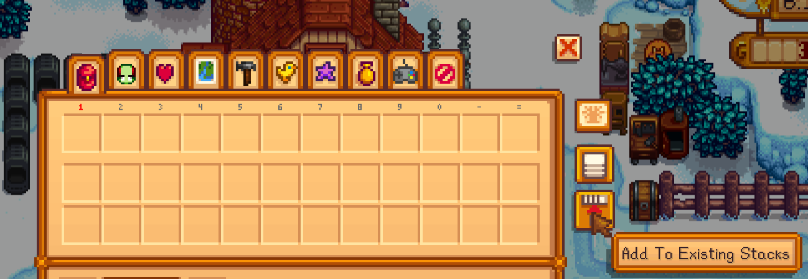

# AutoStore
A Stardew Valley [SMAPI](https://smapi.io) mod that allows you to auto stack your inventory to all nearby chests.  
Like pressing the 'Add to existing stacks' button for each of the chests.

## Features
- Adds a button to the inventory screen to auto stack items to all nearby chests.

- Adds a keybind to auto stack items to all nearby chests. (Default: `Q` for "quick stack")
- If you press it when hovering an item it will only auto stack that item.
- Adds a keybind to pull the item hovered from nearby chests. (Default: `LeftShift + Q`)

## Configuration
For configuring, you might want to check the [Wiki page for configuring mods](https://stardewvalleywiki.com/Modding:Player_Guide/Getting_Started#Configure_mods).  
Or you can use the [Generic Mod Config Menu](https://www.nexusmods.com/stardewvalley/mods/5098) mod.

- `StackKeybind`: The keybind to auto stack items to all nearby chests. (Default: `Q` for "quick stack")
- `FetchKeybind`: The keybind to get the item hovered from nearby chests. (Default: `LeftShift + Q`)
- `DistanceThreshold`: The range in which chests are considered nearby. (Default: `10` tiles)
